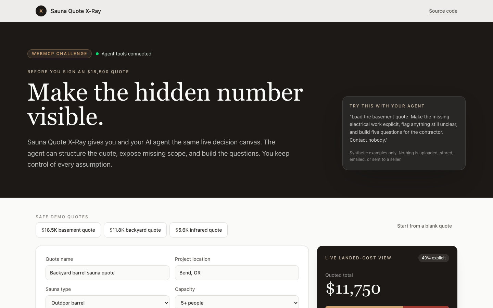

# Sauna Quote X-Ray

[](https://github.com/Ac0AI/sauna-quote-xray/actions/workflows/verify.yml)

> People and AI turn a sauna quote into an honest shared canvas, exposing hidden costs and the exact questions to ask before signing.

Sauna Quote X-Ray is a browser-native WebMCP app created for the [2026 WebMCP Challenge](https://openai.com/webmcp-challenge/). It gives the buyer and their AI agent the same live decision surface instead of hiding agent work in a separate chat transcript.

**Live product:** [sauna.guide/tools/sauna-quote-xray](https://sauna.guide/tools/sauna-quote-xray)

**Standalone challenge mirror:** [sauna-quote-xray.vercel.app/tools/sauna-quote-xray](https://sauna-quote-xray.vercel.app/tools/sauna-quote-xray)

**75-second demo:** [Watch Sauna Quote X-Ray use WebMCP](https://youtu.be/df5EVhSOWpA)

Built by [Sauna Guide](https://sauna.guide), the independent home sauna buying guide.



## Judge it in 60 seconds

1. Open the [live product](https://sauna.guide/tools/sauna-quote-xray) in ChatGPT's in-app browser.
2. Ask: “Load the backyard quote. Make the missing electrical work explicit, flag anything still unclear, and build the contractor questions. Contact nobody.”
3. Watch the visible canvas turn an $11,750 quote into a sourced planning range of $12,250 to $18,650 and six contractor questions.
4. Change one scope status by hand, then ask the agent to inspect the canvas again. The human edit and agent read stay synchronized.

Expected safety result: no quote is uploaded or persisted, no seller is contacted, and every tool result reports `persistedOrSent: false`.

## Challenge criteria evidence

| Criterion | What judges can verify |
|---|---|
| WebMCP Leverage | Eight page-scoped tools read and change one visible React state model through strict schemas and explicit safety annotations. The agent can complete the synthetic review across multiple tool calls while the buyer watches and edits the same canvas. |
| Execution | The no-login production app, 75-second public demo, synthetic fixtures, reviewer instructions, and fresh-browser production smoke test form one complete, runnable buyer workflow. |
| Potential Impact | A realistic $11,750 sauna quote becomes a sourced $12,250 to $18,650 planning range plus six concrete contractor questions before the buyer signs. |
| Creativity and Ambition | The project makes WebMCP a shared decision surface for a high-cost purchase, not a chat-only advisor. Human corrections and agent actions stay synchronized, visible, and reversible without creating a lead. |

## Why WebMCP matters here

A sauna quote can look complete while excluding the $600 to $1,800 circuit, a $1,500 to $3,000 panel upgrade, permits, site work, ventilation, or service responsibility. The agent is good at turning messy scope into structure. The human knows what the seller actually promised. WebMCP lets both work on the same visible state.

The agent can load a synthetic quote, inspect the canvas, set project context, add or remove line items, resolve scope, and build contractor questions. The human can edit every amount and status directly. Every change is visible, inspectable, and page-local.

## WebMCP tools

| Tool | What it does |
|---|---|
| `load_demo_sauna_quote` | Loads one of three synthetic reviewer-safe examples. |
| `get_sauna_quote_xray_state` | Reads the exact visible state and marks seller/user text as untrusted. |
| `set_sauna_project_context` | Updates title, location, sauna type, and capacity. |
| `upsert_sauna_quote_line_item` | Adds or corrects one priced quote row by stable ID. |
| `remove_sauna_quote_line_item` | Removes a mistaken or duplicate row. |
| `set_sauna_quote_scope` | Marks up to ten scope items included, excluded, unclear, or not applicable. |
| `build_sauna_contractor_questions` | Builds a visible question list from unresolved scope. |
| `start_sauna_quote_xray` | Clears the demo and starts a blank review. |

None of the tools persist data, upload files, send email, contact sellers, or create leads.

## Try the core demo

Open the live app in a WebMCP-capable browser and ask:

> Load the basement quote. Make the missing electrical work explicit, flag anything still unclear, and build five questions for the contractor. Contact nobody.

Then change a scope status by hand and ask the agent to inspect the canvas again. That round trip is the product: agent speed, human authority, one shared source of truth.

## Challenge-period work

Sauna Guide's editorial site, public buyer research, and design system existed before the challenge. The Sauna Quote X-Ray product itself was built after the challenge opened on August 25, 2026: the shared quote state, eight WebMCP tools, safety schemas, synthetic fixtures, automated tests, standalone deployment, and submission media are challenge-period work.

See [CHALLENGE_PROVENANCE.md](./CHALLENGE_PROVENANCE.md) for the exact pre-existing boundary, dated commit evidence, and a file-level map of the eligible implementation.

## Run locally

Requirements: Node.js 22+ and pnpm 10+.

```bash
pnpm install
pnpm dev
```

Open `http://localhost:3000/tools/sauna-quote-xray`. ChatGPT's in-app browser supports WebMCP directly. For Chrome, use Chrome 149 or later, enable `chrome://flags/#enable-webmcp-testing`, and restart the browser.

## Verify

```bash
pnpm test
pnpm typecheck
pnpm lint
pnpm build
pnpm test:e2e
pnpm test:production
```

The local Playwright journey installs a WebMCP registration harness, invokes all critical tools, checks negative inputs, and proves that agent mutations appear in the visible human canvas. The production smoke test repeats the core synthetic journey against `https://sauna.guide` in a fresh, unauthenticated browser context. See [TESTING.md](./TESTING.md) for the manual reviewer flow.

## Architecture

```text
WebMCP browser
    -> route-scoped tools
    -> one shared React state/ref
    -> pure quote summary functions
    -> visible ledger, scope, risk range, questions, and activity
```

Public seller price observations and the limited installation ranges live in `src/lib/quote-xray-costs.ts`. Synthetic fixtures and review logic live in `src/lib/quote-xray.ts`. No private customer quotes are included.

## Privacy and safety

- All working state stays in the current tab.
- No quote content is uploaded or persisted.
- No tool can send a request, contact a seller, or create a customer lead.
- The state reader uses `untrustedContentHint: true` for seller- or user-controlled text.
- Schemas reject unknown properties and cap strings, arrays, amounts, and line count.
- The page states where estimates remain unpriced and links to buyer-facing source guides.

See [SECURITY.md](./SECURITY.md) and [NOTICE.md](./NOTICE.md).

## Submission media

The desktop, full-canvas, mobile, 3:2 Devpost, and 16:9 YouTube images in `public/screenshots` are based on captures of the working production app after real WebMCP tool calls. `scripts/record-demo.mjs` records the same live reviewer-safe journey for the public demo video. The narration source is in `demo/narration.txt`, and the reproducible YouTube artwork is in `demo/youtube-thumbnail.svg`.

## License

[MIT](./LICENSE) © 2026 AC0 AI SLU.
